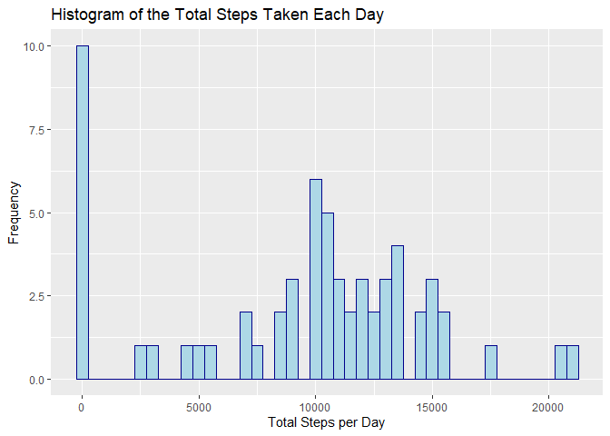
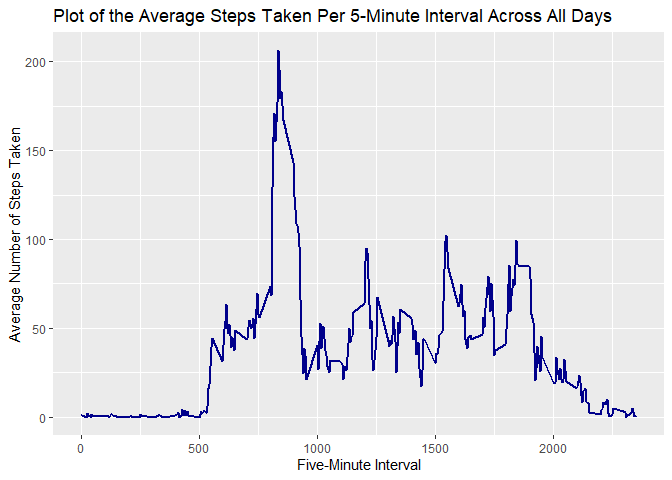
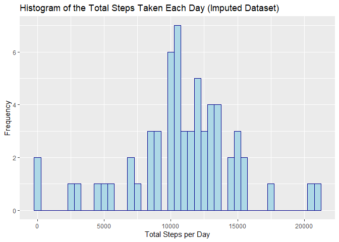
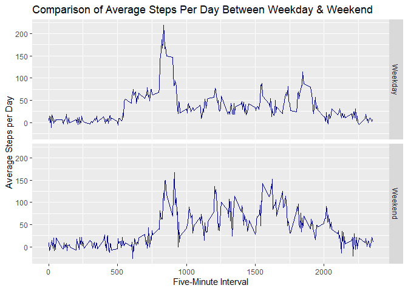

<br>

## 1. Loading and preprocessing the data

<br>
The code below first downloads data into proper folders. Then it reads into the 
`activity.csv` file, changes the date column to R Date object, and creates two 
variables that help us tell whether a date is a weekend and which day of a week
a given date is.


```r
library(rmarkdown) #for kniting to html
library(tidyverse) #for data cleaning
library(lubridate) #for date operation
library(Amelia) #for multiple imputation

fileurl <- "https://d396qusza40orc.cloudfront.net/repdata%2Fdata%2Factivity.zip"
zipfile <- "./data.zip"
filedir <- "./data"
unzip_path <- "./data"

if (!file.exists(filedir)){dir.create(filedir)}
download.file(fileurl, file.path(zipfile))
unzip(zipfile, exdir = unzip_path)
datafile <- file.path(unzip_path,"activity.csv")

activity <- read.csv(datafile)
activity$date <- ymd(activity$date) # transform original data object
activity$weekend <- as.factor(ifelse(weekdays(activity$date)=="Saturday"|
                                             weekdays(activity$date)=="Sunday",
                                                      'Weekend','Weekday'))
activity$dayofweek <- as.factor(weekdays(activity$date))
```
<br>
<br>


## 2. What is mean total number of steps taken per day?  

The total number of steps taken per day

```r
t <- activity %>% group_by(date) %>% 
        summarise(steps_perday = sum(steps, na.rm = TRUE))
```

<br>
A histogram that shows the total steps taken each day
<br>


```r
ggplot(data = t, aes(x=steps_perday)) +
        geom_histogram(binwidth = 500, color="darkblue", fill="lightblue") +
        labs(x = "Total Steps per Day", y = "Frequency", 
             title = "Histogram of the Total Steps Taken Each Day")
```

<!-- -->
<br>
<br>

The mean and median of the steps taken per day
<br>


```r
t %>% summarise(average = mean(steps_perday, na.rm = TRUE), 
                median = median(steps_perday, na.rm = TRUE))
```

```
## # A tibble: 1 x 2
##   average median
##     <dbl>  <int>
## 1   9354.  10395
```
<br>


## 3. What is the average daily activity pattern?
<br>


```r
int_avg <- activity %>% group_by(interval) %>% 
  summarise(avg=mean(steps, na.rm = TRUE))
```


```r
ggplot(data = int_avg, aes(interval, avg)) +
  geom_line(col="darkblue", linetype=1, size=1)+
  labs(x = "Five-Minute Interval", y = "Average Number of Steps Taken", 
             title = "Plot of the Average Steps Taken Per 5-Minute Interval Across All Days")
```

<!-- -->


<br>
Now, we want to know Which 5-minute interval, on average across all the days in the dataset, contains the maximum number of steps. The following code output 
shows that **interval #835 contains the maximum numbers of steps (avg = 206.17)**. 


```r
int_avg[which.max(int_avg$avg),]
```

```
## # A tibble: 1 x 2
##   interval   avg
##      <int> <dbl>
## 1      835  206.
```
<br>


## 4. Imputing missing values

<br>
First, let's check the missingness. We have a total of 2,304 rows of missing value, all in the `steps` column.


```r
sum(is.na(activity))
```

```
## [1] 2304
```

```r
colSums(is.na(activity))
```

```
##     steps      date  interval   weekend dayofweek 
##      2304         0         0         0         0
```


<br>
I'll use **multiple imputation**, a sophisticated bootstrapping algorithm that 
is gaining popularity among social science statistics (which is my field), to 
impute the missing value in the dataset. I use Gary King's `Amelia II` package to implement the algorithm. Documentation of the Amelia II package can be seen here at: [Amelia II: A Program for Missing Data](https://cran.r-project.org/web/packages/Amelia/vignettes/amelia.pdf) if 
you are interested.

<br>
Please note that for this assignment, given the simplicity of the dataset, 
I recognized the fact that mean imputation should be valid enough. I use 
multiple imputation here for my own practice, and also to share with you 
this technique. It will be very useful in the real-world data analysis. 
<br>


```r
# Imputation Process
dfc <- amelia(activity, m = 5, ts = "date", idvars = c("weekend", "dayofweek"))
```


```r
# Extract one imputed dataset
dfcc <- dfc$imputations$imp1
# Check if there is still missing value
sum(is.na(dfcc))
```

```
## [1] 0
```

<br>
You may notice that I imputed the data five times. In real-world analysis, usually we will be asked to use the five imputed datasets to do our analysis, 
and for whatever statistics/parameter we get from our calculation, we take the 
mean of the results from all five datasets. Usually, analysis result using either of the five datasets should NOT be significantly different from each other. For simplicity reason, in this assignment, I just **randomly pick one** 
**dataset `imp1` from the five**, and continue on the analysis. 

<br>
Now let's make a histogram of the total number of steps taken each day 
**after** missing values are imputed.
<br>


```r
imp_step_perday <- dfcc %>% group_by(date) %>% 
  summarise(stepsperday=sum(steps))
```


```r
ggplot(data = imp_step_perday, aes(x=stepsperday)) + 
  geom_histogram(col="darkblue", fill="lightblue", binwidth = 500) + 
  labs(x = "Total Steps per Day", y = "Frequency", 
             title = "Histogram of the Total Steps Taken Each Day (Imputed Dataset)")
```

<!-- -->

<br>
Let's check the mean and median total number of steps taken per day
<br>


```r
imp_step_perday %>% 
  summarise(avg=mean(stepsperday), median=median(stepsperday))
```

```
## # A tibble: 1 x 2
##      avg median
##    <dbl>  <dbl>
## 1 10843.  11015
```

<br>
Comparing the mean & median and the histogram of the imputed dataset with 
results from the original dataset. I find that the imputed dataset has both 
**significantly higher mean and median**. In addition. a comparison of the 
historgram of the imputed and original data shows that the **imputed data seems**
**to follow a rough normal distribution**, with observations gather around the value of 10,000. In contrast, **the histogram of the original dataset has two peaks**, one higher peak at 0, and one lower peak also at the value of 10,000. 
<br>
<br>
<br>

## 5. Are there differences in activity patterns between weekdays and weekends?


<br>
I have create a new factor variable in the dataset with two levels – 
“weekday” and “weekend” indicating whether a given date is a weekday or weekend day. The code can be found at section 1 of this document *Loading and Preprocessing the Data*.

<br>
A panel plot containing a time series plot of the 5-minute interval (x-axis) and the average number of steps taken, averaged across all weekday days or weekend days (y-axis).


```r
meansteps <- dfcc %>% group_by(interval, weekend) %>% 
  summarise(avg=mean(steps))
```

```r
ggplot(data=meansteps, aes(interval,avg))+
  geom_line(col="darkblue")+
  facet_grid(weekend~.)+
  labs(x = "Five-Minute Interval", y = "Average Steps per Day", 
       title = "Comparison of Average Steps Per Day Between Weekday & Weekend ")
```

<!-- -->
